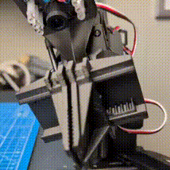
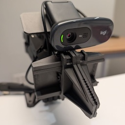
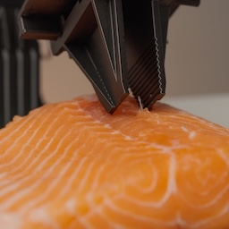
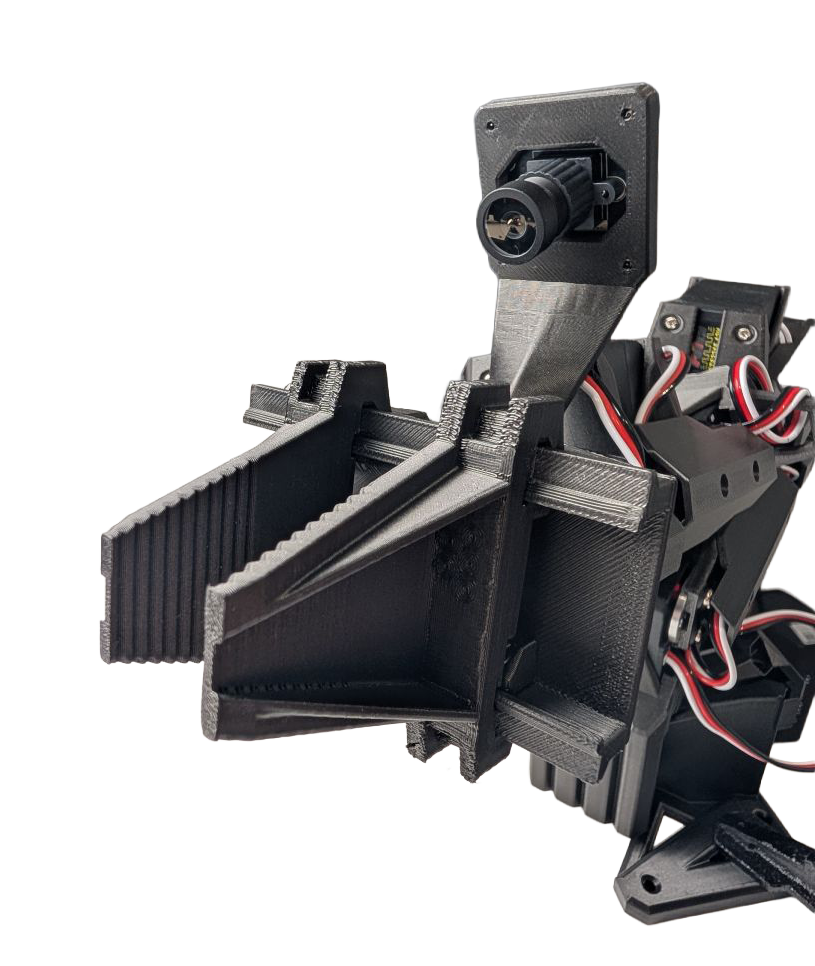
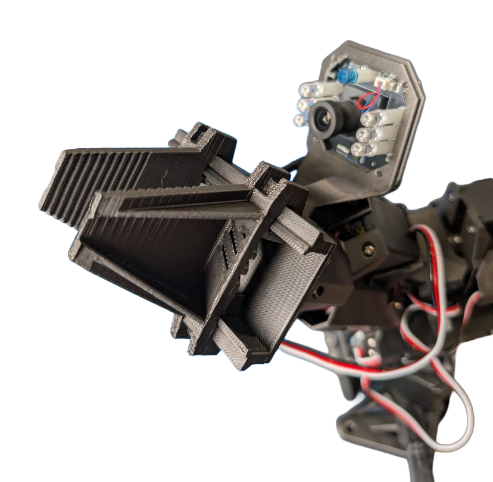
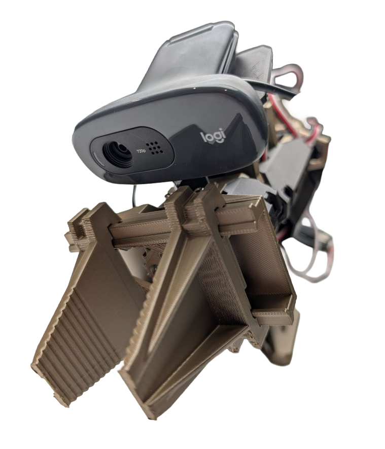

# 🤖 Parallel Jaw Gripper

  
  
  

A parallel jaw gripper for robot arms. Parallel jaws = predictable gripping = less headache when picking stuff up. Compatible with **SO-101** and **Elrobot** arms.

## 📋 Specs

| | |
|---|---|
| Finger length | 44 mm |
| Finger width | 22 mm |
| Stroke per jaw | 27 mm |
| Total gripping stroke | 54 mm |
| Closing force | ≥4 kg |

## 🖨️ Printing

**Filament needed:** ~91g PLA

| Format                               | Link                                               | Time (h)                |
|--------------------------------------|----------------------------------------------------|-------------------------|
| **Bambulab (PLA only)**              | [.3mf](STL/print/basic.3mf)                        | 4.5                     |
| Bambulab AMS (PLA + PETG supports)   | [.3mf](STL/print/ams.3mf)                          | 9.5 on A1/P2S, 6 on H2D |
| Standard STL (no camera mount)       | [.stl](STL/print/gripper_no_camera_mount.stl)      | -                       |
| Standard STL (27mm holes camera mount) | [.stl](STL/print/gripper_27mm_camera_mount.stl)    | -                       |
| Standard STL (34mm holes camera mount) | [.stl](STL/print/gripper_34mm_camera_mount.stl)    | -                       |
| Standard STL (generic webcamera mount) | [.stl](STL/print/gripper_generic_camera_mount.stl) | -                       |

Inside bambulab print files there are 3 different cameras mounts. Choose the one that fits your camera and remove the others.
PETG support improves the gripper appearance. It doesn't affect the gripper performance.
For standard stl choose 4 perimeters for the best results.

## 🔧 Assembly

**You'll need:**
- 1× ST3215 motor (horn, screws & cable included)
- PH1 and PH2 screwdrivers

👉 [Assembly Manual](Gripper_ElRobot.pdf)

## 📷 Camera Mounts

Modular camera mounts snap onto the gripper — pick the one that fits your camera and swap anytime.

| Camera | Mount                                                | Photo                                                  |
|--------|------------------------------------------------------|--------------------------------------------------------|
| Innomaker U20CAM-1080P (27mm holes) | [STL](STL/camera_mounts/CameraMount_square_27mm.stl) |       |
| Innomaker Day&Night Vision (34mm holes) | [STL](STL/camera_mounts/CameraMount_square_34mm.stl) |        |
| Generic webcam | [STL](STL/camera_mounts/CameraMount_regular.stl)     |   |

## 📁 Source Files

| Type | Link |
|------|------|
| STL | [/STL](./STL) |
| STEP | [/STEP](./STEP) |

## 🌐 Community

- 🐦 [X](https://x.com/norma_core_dev)
- 💬 [Discord](https://discord.gg/Z4Ytw3QfHP)
- 🐙 [GitHub](https://github.com/norma-core/norma-core)
- 📢 [Reddit](https://www.reddit.com/r/NormaCore/)
